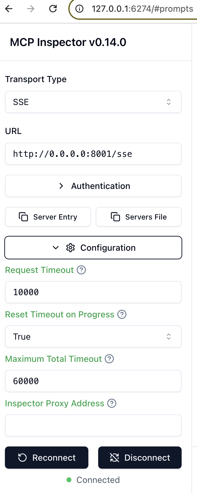

#### Launch the MCP Server

```bash
uv venv             
source .venv/bin/activate    
uv add arxiv mcp anthropic nest_asyncio
uv run research_server.py
````


You can then open a terminal and run your server using (`uv run research_server.py`), you'd need to keep the terminal open for the server to keep on running. You'll get a message in the terminal that the server is running at a given address. The `URL` that you would need to provide to the inspector or chatbot is that address with the appended `/sse` at the end. In a second terminal, you can launch the MCP inspector or your chatbot. Please check the comments below on how you can update the MCP chatbot. 

http://0.0.0.0:8001

#### Testing the Provided Remote Server using MCP Inspector

Launch the inspector

```bash
npx @modelcontextprotocol/inspector
```
http://127.0.0.1:6274/

- To open the terminal, run the cell below.
  - The terminal might show the `work` directory or `L4/mcp_project`. You can stay in any directory, you don't need to navigate to `L9/mcp_project`. That's because you'll test a remote server that is already up and running, so you can launch the inspector from any directory.
  - If the terminal shows `L4/mcp_project` and you still have the inspector open from L4, you can close it by typing `CTRL+C` and then launch it again.
- To launch the inspector, type in the terminal: `npx @modelcontextprotocol/inspector`
  - If you get a message asking "need to install the following packages", type: `y`
- You will get a message saying that the inspector is up and running at a specific address. To open the inspector, click on that given address. The inspector will open in another tab.
- Please check the "Inspector UI Instructions" below.
- Once you're done with the inspector UI, make sure to close the inspector by typing `Ctrl+C` in the terminal below.




#### Run the chatbot connected to the MCP server

#### Anthropic API token
## create a server_config.json file, that includes the available servers

```bash
uv venv
source .venv/bin/activate

uv add arxiv mcp anthropic nest_asyncio
uv run mcp_chatbot.py
```